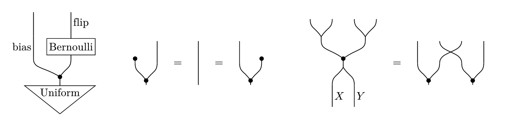

# copycat

String diagrams for monoidal categories with copying and discarding, that is, CD categories and in particular Markov categories, drawn in the style of Fritz (2020) and Cho–Jacobs (2019) and built on [CeTZ](https://typst.app/universe/package/cetz).
The vocabulary is that of process theories: wires carry systems, boxes are processes, states and effects sit at the ends of wires, and diagrams are composed in serial and in parallel.



## Quick start

```typst
#import "@preview/copycat:0.1.0": *

$ #string-diagram(serial(state("Uniform"), wire($[0,1]$), process("Bernoulli"), wire($"Bool"$))) $

$ #string-diagram(serial(copy, parallel(discard, wire()))) = #string-diagram(wire()) $
```

The package exports `string-diagram`, the combinators `serial`, `parallel` and `styled`, the primitives `wire`, `process`, `state`, `effect`, `copy`, `discard`, `swap`, `bundle` and `unbundle`, `primitive` for defining your own, and `default-style`.
They are meant to be used unqualified, as above.
`state` is the one name that shadows a Typst builtin; Typst's own stays reachable as `std.state`, or import the names you use explicitly and rename that one: `#import "@preview/copycat:0.1.0": serial, parallel, wire, state as dist`.
The renderer is deliberately not called `diagram`, which fletcher and lilaq both export.
If you want the short name, `#let diagram = string-diagram` gives it to you, and most documents wrap it anyway to fix a style once: `#let sd = string-diagram.with(style: (unit: 0.5cm))`.

## Conventions

Diagrams are read **bottom to top** by default: inputs enter at the bottom edge and outputs leave at the top edge.
The `direction` style key turns the finished diagram to read top to bottom, left to right, or right to left (see [Rendering](#rendering)).

Layout happens in abstract **units**, and one unit is rendered as `style.unit`.
Wire slots are one unit apart, and an element with `n` wires on an edge carries them centred within its own width.

Every primitive and combinator returns a *diagram value*.
Its `inputs` and `outputs` fields give the wire counts, which is all a document needs to read from it.
The remaining fields drive the layout and are described in [docs/design.md](docs/design.md); they are not part of the stable interface.

## Primitives

| Call | Wires | Drawing |
|---|---|---|
| `wire(label, length: 1, side: "right")` | 1 → 1 | a vertical wire, `length` units tall, with `label` set beside it. The label may also be passed as `label: ...`. `wire()` is the bare identity. Both ends are free to move sideways, and the label moves with them. |
| `process(label, inputs: 1, outputs: 1)` | n → m | a process: a white box with `label` inside and short wire stubs above and below, so that boxes stacked by `serial` never touch. |
| `state(label, outputs: 1)` | 0 → m | a state, i.e. a morphism with no inputs, which in a Markov category is a distribution: a downward-pointing triangle (apex at the bottom) whose outputs leave the flat top edge. |
| `effect(label, inputs: 1)` | n → 0 | the mirror image of `state`, apex at the top. |
| `copy` | 1 → 2 | a wire rising to a black dot, from which two arms curve out to the two outputs. |
| `discard` | 1 → 0 | a wire ending in a black dot, or in a ground symbol if the style's `discard.kind` is `"ground"`. It slides sideways like a wire to sit over whatever it discards, and its dot sits at the same height as a copy's dot (`dot.height`), below every arm crossing the layer. |
| `swap` | 2 → 2 | two wires crossing. |
| `unbundle` | 1 → 2 | a fork *without* a dot, for drawing one product wire `X × Y` as two wires. |
| `bundle` | 2 → 1 | the mirror image of `unbundle`. |

The arms of `copy`, `unbundle` and `bundle` are flexible: they end wherever the neighbouring layer needs them, rather than at fixed slots.
So is a plain `wire`, which is why a narrow layer of wires stacked over a wide box comes out straight rather than kinked.

`copy`, `discard`, `swap`, `unbundle` and `bundle` are plain values, not functions: write `copy`, not `copy()`.
To restyle one of them, wrap it in `styled` (see below).
`process`, `state` and `effect` also take `stroke` and `fill` arguments, and `wire` a `stroke` argument, restyling just that element, including its wire stubs; `auto` inherits from the style and `none` disables.

Boxes and triangles grow to fit their labels, so `process("Bernoulli")` is a wide box, not a clipped one.
Labels are ordinary Typst content: a string is typeset upright as it stands, and `$X$` gets you math.

## Custom primitives

`primitive` turns a CeTZ drawing into an element that composes like the built-in ones.

```typst
#import "@preview/cetz:0.5.2": draw

#let cap = primitive(inputs: 0, outputs: 2, width: 2, height: 1, draw: (style, geometry) => {
  draw.bezier((0.5, 1), (1.5, 1), (0.5, 0.2), (1.5, 0.2), stroke: style.wire.stroke)
})
```

The element is `width` by `height` units, its wire slots are centred on its edges unless `input-positions` and `output-positions` say otherwise, and `draw` is called as `(style, geometry) => ...`, where `style` is the resolved style and `geometry` holds `width`, `height`, `input-positions`, `output-positions` and `measure`.
It draws in unit coordinates with the origin at the bottom-left corner and returns CeTZ elements.
The declared size counts towards the canvas whether or not the drawing fills it.
The style it receives is fully resolved, so `style.wire.stroke`, `style.box.fill` or `style.dot.radius` can be handed to CeTZ as they are; import the same CeTZ version as copycat does.
To size an element to a label, give `width` or `height` as a function `(style, measure) => ...`, where `measure(label)` returns the label's `width` and `height` in units.
These are measured along the element's own width and height, so an element that fits its label in both dimensions stays correct in every reading direction.
Custom elements are rigid: their slots stay where they are put, and neighbouring wires and arms bend to meet them.
The [gallery](docs/gallery.typ) draws a cup and a cap, a spider, and a trapezoid that measures its label.

## Combinators

`serial(..ds)` composes sequentially, with **the first argument at the bottom**.
Output slot j of each diagram is connected to input slot j of the one above it, and composing diagrams whose wire counts disagree is an error.
Children are centred horizontally within the widest of them, so connected slots often do not line up, and rather than bending the connection, `serial` moves the wires that are free to move.
A box holds its slots where they are, a wire follows the box or wire it faces and carries its whole column, including its label, along with it, and the arm of a `copy` yields to either.
A wire that is held at two different x, by a box below and another box above, becomes a smooth S-curve over its own length, and a `copy` arm runs from its dot straight to its target, leaving the dot at an angle and arriving vertically, which is how these diagrams are drawn on paper.
Only when a pair is rigid on both sides, which is rare, is a band of `style.bend` units inserted, and every slot at that junction is carried across it, as a straight line or an S-curve.
A wire refuses to move into a box standing next to it, and falls back to the band instead.

`parallel(..ds)` composes in parallel, left to right, adding widths and inserting `style.gap` between neighbours.
Children shorter than the tallest one are centred vertically and their wires are extended straight to the common bottom and top edges.
A child with no outputs (such as `discard`) is aligned with the bottom edge instead, and one with no inputs (such as a `state`) with the top edge, since their only connections are on that side.

Both combinators return a single argument unchanged, and both accept no arguments at all, which gives the empty diagram.
Both also accept a `style:` argument that overrides style keys for the sub-diagram they build.

`styled(diagram, ..overrides)` is the same thing as a standalone wrapper: `styled(copy, stroke: red)` is a red copy, and `styled(d, box: (fill: blue))` restyles every box inside `d`.
`unit`, `padding` and `direction` describe the diagram as a whole, so overriding them for a sub-diagram is an error; pass them to `string-diagram` instead.

## Rendering

`string-diagram(diagram, style: (:), baseline: auto)` turns a diagram value into content.
`style` is merged over `default-style` with CeTZ's folding rules (see below), so `style: (stroke: (paint: red))` keeps the default thickness.
The result is a box whose baseline is shifted so that the diagram's vertical centre lands on the math axis, which is what makes `$ #string-diagram(a) = #string-diagram(b) $` put the `=` between the two diagrams rather than under them.
Pass `baseline` explicitly to override that.

The `direction` style key sets the reading direction: `"up"` (the default), `"down"`, `"right"` or `"left"`.
The layout is the same in every direction; the finished drawing is flipped or turned as a whole, so `"down"` is the vertical mirror image of `"up"`, and in the horizontal directions the first factor of a `parallel` is on top.
All labels stay upright, and boxes and triangles are sized so that their labels fit whichever way the diagram is read; in a horizontal diagram, boxes are therefore long along the flow, as such diagrams are usually drawn.
There, a wire label with `side: "right"` sits below its wire and one with `side: "left"` above it.

```typst
#string-diagram(d, style: (direction: "right"))
```

## Style

The style follows [CeTZ's model](https://cetz-package.github.io/docs/basics/custom-types/style): generic keys at the root, one group of keys per kind of element, and `auto` meaning "inherit the root key of the same name".
Strokes fold like in CeTZ: a partial stroke such as `(paint: red)` or `(dash: "dashed")` changes only what it names, while a full stroke like `red + 1pt` replaces the inherited one.
A partial stroke without a paint disappears together with the stroke it folds onto, so `stroke: none` hides boxes, triangles and dots along with the wires, and a more local override brings an element back only by naming a paint.
Unknown keys are rejected with an error, so typos do not pass silently.

Root keys:

| Key | Meaning |
|---|---|
| `unit` | length of one abstract unit; may be given in `em` to scale with the text |
| `direction` | reading direction: `"up"`, `"down"`, `"right"` or `"left"` |
| `stroke` | base stroke, inherited by every element stroke that is `auto` |
| `fill` | base fill of solid shapes (boxes and triangles) |
| `inset` | padding around a label inside a box or triangle |
| `margin` | horizontal gap between a shape and its slot boundary, so that neighbours keep their distance |
| `stub` | length of the wire stubs above and below a box |
| `bend` | height of the S-bend band inserted by `serial` |
| `gap` | extra space between `parallel` factors |
| `padding` | canvas padding, so that strokes are not clipped |

Element groups:

| Key | Meaning |
|---|---|
| `wire.stroke` | stroke of all wires |
| `wire.arm-angle` | sideways reach, in multiples of the rise, at which a fork's arm starts leaving the dot at an angle rather than vertically; `0` makes every arm leave at an angle |
| `box.stroke`, `box.fill` | stroke and fill of process boxes |
| `box.height` | minimum height of a process box |
| `box.inset`, `box.margin` | inset and margin of boxes; `auto` inherits the root keys |
| `triangle.stroke`, `triangle.fill` | stroke and fill of `state` and `effect` triangles |
| `triangle.height` | minimum height of a triangle |
| `triangle.aspect` | width/height a triangle aims for before it grows taller instead |
| `triangle.inset`, `triangle.margin` | as for boxes |
| `dot.radius` | radius of the copy and discard dots |
| `dot.height` | height of the dots above their junction, and of the branch point of `unbundle` and `bundle` |
| `dot.fill` | fill of the dots; `auto` follows the wire paint rather than the root fill |
| `discard.kind` | `"dot"` or `"ground"` |
| `label.size` | text size of all labels |
| `label.sep` | distance of a wire label from its wire |

Plain numbers are in units; `unit`, `label.size` and stroke thicknesses are Typst lengths.
The default values are exported as `default-style`.

A style can be overridden at three levels: the whole diagram, a sub-diagram, or a single element.

```typst
#string-diagram(d, style: (stroke: red))                // recolours wires, boxes and dots alike
#let blue-boxes = styled(d, box: (fill: blue))  // likewise serial(a, b, style: (bend: 0.8))
#let red-f = process("f", stroke: red)            // this box only, stubs included
```

## Diagrams in running text

Inline diagrams keep the default unit, which is generous for 11 pt text, so pass a smaller one:
`#string-diagram(copy, style: (unit: 0.45cm))`.
Labels do not shrink with `unit`, because their size follows the surrounding text; shrink them too with `label: (size: 0.8em)` if a labelled diagram looks top-heavy inline.

A wire label is placed to the right of its wire by default, which collides with whatever stands to the right of it in a `parallel`.
Move it with `wire($X$, side: "left")`.

## More

[docs/gallery.typ](docs/gallery.typ) renders the full repertoire, including reading directions and custom primitives; [docs/gallery.pdf](docs/gallery.pdf) is its output.
[docs/design.md](docs/design.md) explains how the layout works, for anyone who wants to change the library itself.

## License

MIT, see [LICENSE](LICENSE).
